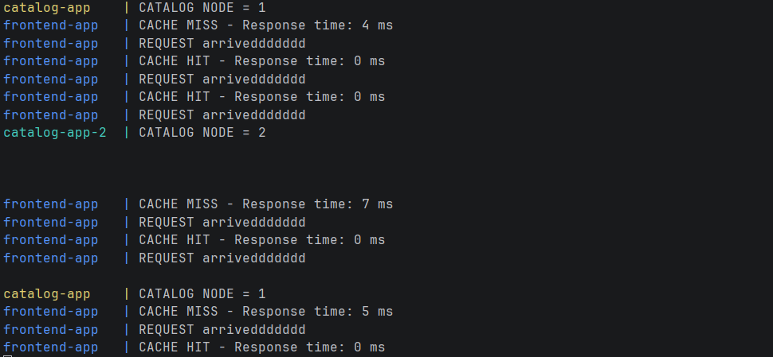
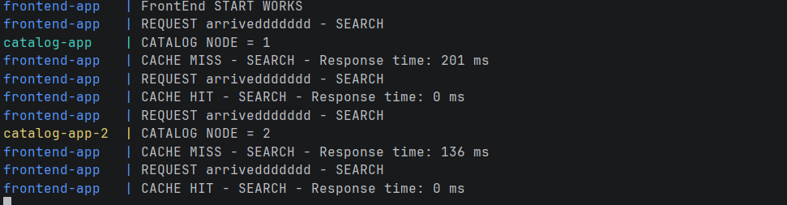
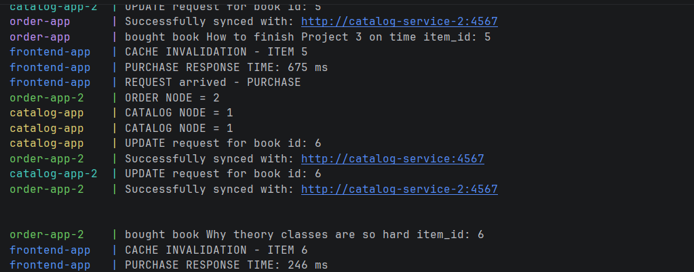

# 📊 Performance Results — Bazar.com

## 🔬 Objective
Measure response time of frontend requests with and without caching.

---

## 📈 Results Table

| Request Type | Cache Status | Response Time |
|--------------|-------------|---------------|
| info         | MISS        | 5–35 ms       |
| info         | HIT         | ~0 ms         |
| search       | MISS        | 120–200 ms    |
| search       | HIT         | ~0 ms         |
| purchase     | No cache    | 200–700 ms    |

## 🚀 Cache Impact

Caching significantly reduces latency for read operations.
- Cache HIT avoids backend calls → near zero response time
- Cache MISS queries catalog service → higher latency
- info

- Search

- purchase (no cache)
- 
## 🔄 Cache Invalidation Test

After a purchase operation:
- Cache entry is invalidated
- Next info request results in CACHE MISS
- Ensures strong consistency

## 🔁 Replication Overhead

Requests are load-balanced using Round Robin.
Response time slightly varies depending on selected replica.